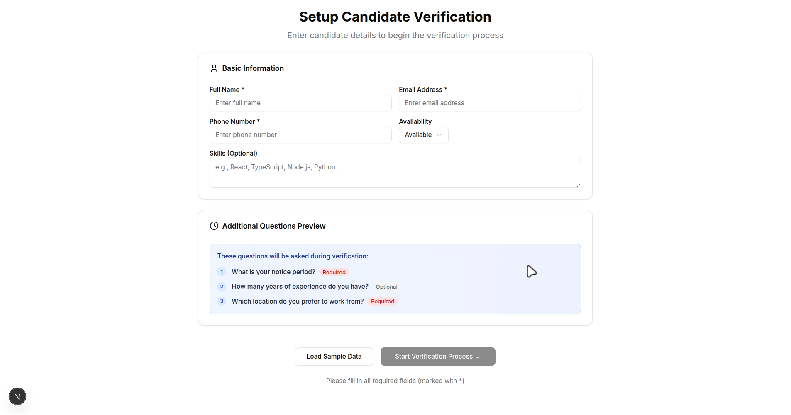
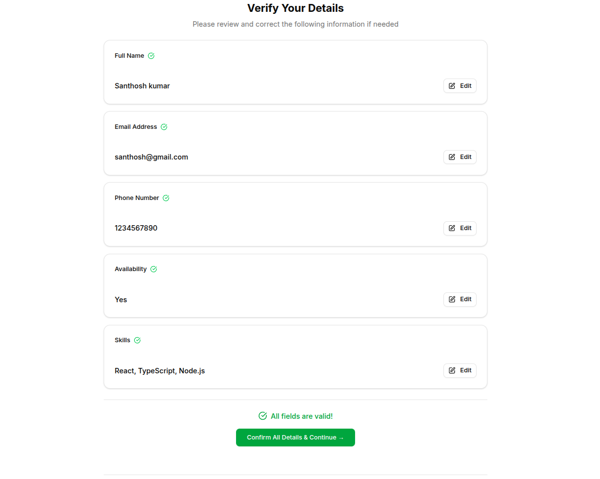
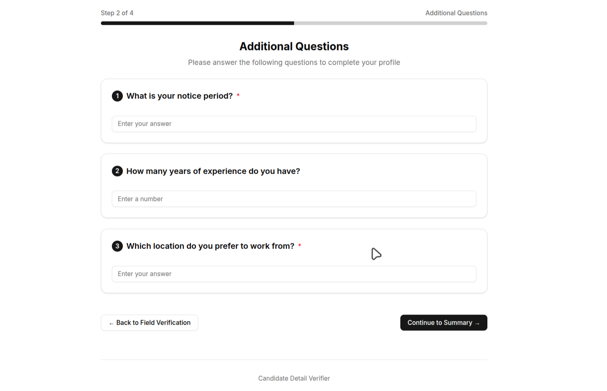
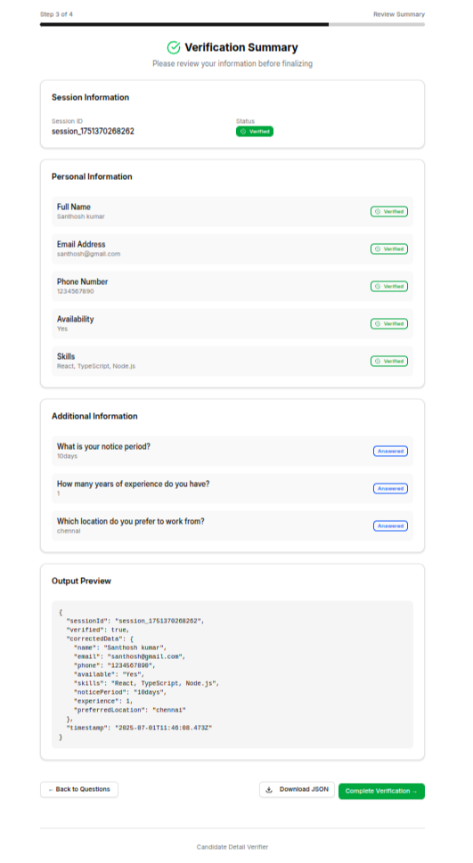
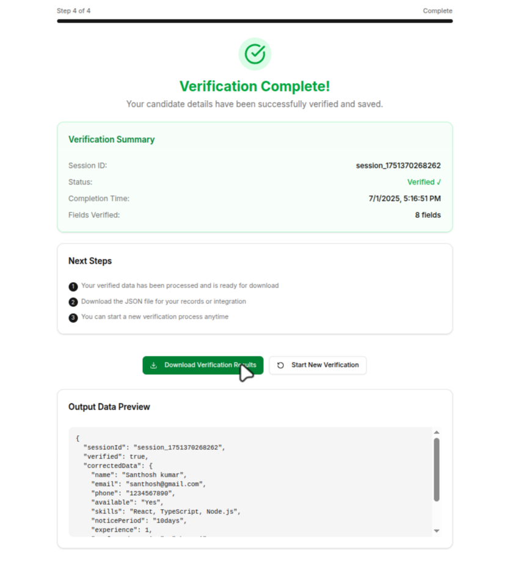
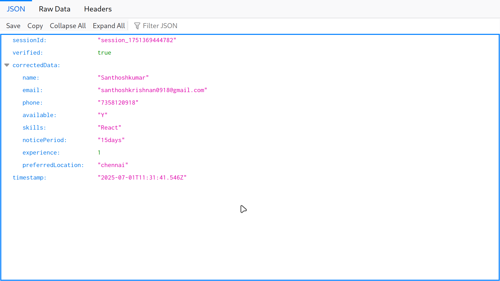

# Candidate Detail Verifier

A Modern web based verification system that validates candidate information through screening flow with dynamic validation, This tool demonstrates clean validation logic.

## What it does

- Loads candidate data and validates fields like email, phone, etc.
- Walks users through confirming or correcting their info
- Asks additional questions (notice period, experience, location)
- Generates a clean JSON output with verified data

## Quick Start

### 1. Clone the repository

```bash
git clone https://github.com/santhoshkumar0918/Candidate-verifier-app-internai
cd candidate-detail-verifier
```

### 2. Install dependencies

```bash
npm install
```

### 3. Start development server

```bash
npm run dev
```

### 4. Open in browser

- Web Interface: http://localhost:3000
- API Endpoint: http://localhost:3000/api/verify

Enter your candidate details and follow the guided verification process.

## Project Walkthrough

### Step 1: Data Input

- Enter basic candidate info (name, email, phone, availability, skills)
- Shows preview of additional questions that'll be asked later
- Has basic validation before proceeding

### Step 2: Field Verification

- Review each field with clear validation feedback
- Edit any incorrect information inline
- After Reviewed each field , click the confirm button for addtional question section.

### Step 3: Additional Questions

- Answer dynamic questions based on the input configuration
- Supports different question types (text, number, yes/no)
- Required vs optional field handling

### Step 4: Summary & Export

- Review all verified information
- Click Save & download the final JSON output
- Complete the verification process

## Screenshots

Check the output screenshots to see the application in action:

- **Step 1 - Data Input:** `public/page1.png`
- **Step 2 - Field Verification:** `public/page2.png`
- **Step 3 - Additional Questions:** `public/page3.png`
- **Step 4 - Verification Summary:** `public/page4.png`
- **step 5 - Summar & Export:** `public/page5.png`
- **Output JSON:** `public/output_json.png`








## Demo Video

Watch the complete application walkthrough and demonstration:

[](https://youtu.be/eKX3d-16oCw)

🎥 **[Watch Demo Video](https://youtu.be/eKX3d-16oCw)**

This video demonstrates the complete verification flow from data input to final JSON export.

## API Usage

The app also provides a REST API for programmatic access:

```bash
# Check API status
GET http://localhost:3000/api/verify

# Submit verification data
POST http://localhost:3000/api/verify
Content-Type: application/json
```

### Request Body Format

```json
{
  "sessionId": "sessionId_12345678",
  "fields": {
    "name": "Santhoshkumar",
    "email": "Santhosh@gmail.com",
    "phone": "1234567890",
    "available": "Yes",
    "skills": "React, TypeScript, Node.js"
  },
  "additionalQuestions": [
    {
      "id": "noticePeriod",
      "questionText": "What is your notice period?",
      "type": "text",
      "required": true
    },
    {
      "id": "experience",
      "questionText": "How many years of experience do you have?",
      "type": "number",
      "required": false
    },
    {
      "id": "preferredLocation",
      "questionText": "Which location do you prefer to work from?",
      "type": "text",
      "required": false
    }
  ],
  "additionalAnswers": {
    "noticePeriod": "15 days",
    "experience": 4,
    "preferredLocation": "Chennai"
  }
}
```

### Response Body Format

```json
{
  "success": true,
  "data": {
    "sessionId": "sessionId_12345678",
    "verified": true,
    "correctedData": {
      "name": "Santhoshkumar",
      "email": "Santhoshkumar@gmail.com",
      "phone": "1234567890",
      "available": "Yes",
      "skills": "React, TypeScript, Node.js",
      "noticePeriod": "15 days",
      "experience": 4,
      "preferredLocation": "Chennai"
    },
    "timestamp": "2025-07-01T09:28:51.292Z"
  },
  "message": "Verification completed successfully"
}
```

## My Approach

When I got this assignment, I wanted to build something that felt professional and actually usable, not just a tech demo.

**Architecture decisions:**

- Went with Next.js for the full-stack simplicity
- Used TypeScript everywhere because validation is crucial here
- Chose Zustand for lighweight and boilerplate code
- Zod for validation since it plays nicely with TypeScript

**UX thinking:**

- Made it a guided flow instead of one giant form
- Added visual progress so users know where they are
- Inline editing because forcing users to start over is annoying
- Clean, straightforward data entry process

**Technical choices:**

- Kept validation logic separate so it's reusable
- Used proper HTTP status codes in the API
- Made the question system extensible even though the requirements were fixed
- Added error boundaries and proper loading states

## File Structure

```
app/
├── api/verify/route.ts     # REST API endpoint
├── page.tsx                # it wraps all our components
├── layout.tsx
components/
├── DataInput.tsx           # Step 1: Basic info
├── FieldVerification.tsx   # Step 2: Confirm fields
├── AdditionalQuestions.tsx # Step 3: Extra questions
├── SummaryScreen.tsx       # Step 4: Review & download
lib/
├── store.ts                # State management
├── validation.ts           # All validation logic
├── types.ts                # TypeScript definitions
data/
├── input.json
├── output.json
```

## Tech Stack

- **Frontend:** Next.js 15, React 19, TypeScript
- **Styling:** Tailwind CSS with Shadcn UI components
- **State:** Zustand (lightweight)
- **Validation:** Zod schemas
- **API:** Next.js API routes

## Testing

Load the app and enter some candidate details - try entering invalid email formats or short phone numbers to see the validation in action.

For API testing, check out the `input.json` and `output.json` files to see the expected format. and then it the api endpoints with the postman.

---

**THANK YOU FOR GIVING THIS OPPORTUNITY**
